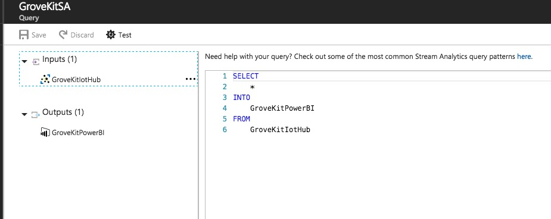

# Overview
An on-demand real-time analytics service to power intelligent action.
Here we use it process IoTHub data and send to PowerBI.

## Setup SA
1. Add new SA, "New --> Internet of Things --> New Stream Analytics Job"
2. Click Inputs, Click Add, Source choice "IoT hub", Consumer group choice "sa"
3. Click Outputs, Click Add, Sink choice "Power BI", Authorize or Create.
4. Click Query, copy content of query.txt to here.
5. Click Overview, start.

Note: SA costs are high if you do not need to close in time

